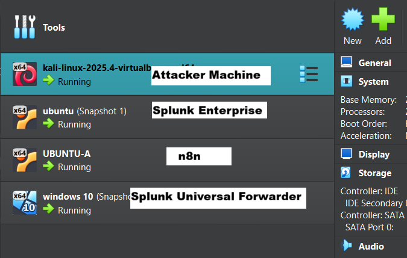

# ai-assisted-soc-alert-automation-splunk-n8n-ollama

AI-assisted SOC alert automation lab using Splunk SIEM, n8n workflow automation, Ollama LLM, and Slack integration to detect and analyze brute-force attacks.

## Project Overview
This project demonstrates an automated SOC (Security Operations Center) workflow that detects a brute-force attack, analyzes the alert using a local AI model, and sends an automated notification to Slack.

The system integrates Splunk SIEM, n8n workflow automation, and Ollama LLM to simulate how modern SOC teams automate alert triage and response.

## Architecture

The project environment consists of four virtual machines deployed in a controlled SOC lab environment to simulate real-world security monitoring, attack detection, and automated alert response.

1. Kali Linux – Attacker machine used to simulate brute-force attacks
2. Ubuntu Desktop – Splunk SIEM server for log analysis and alert generation
3. Ubuntu Server – Automation server running n8n (Docker) and Ollama AI model
4. Windows 10 – Target machine with Splunk Universal Forwarder installed

Attack Flow:

Kali Attacker → Windows Target → Splunk SIEM → Webhook → n8n Automation → Ollama AI → Slack Alert
