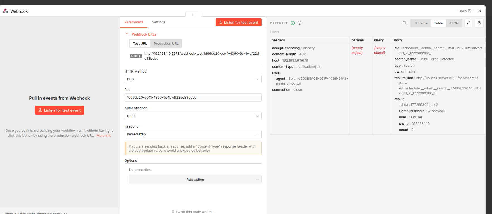
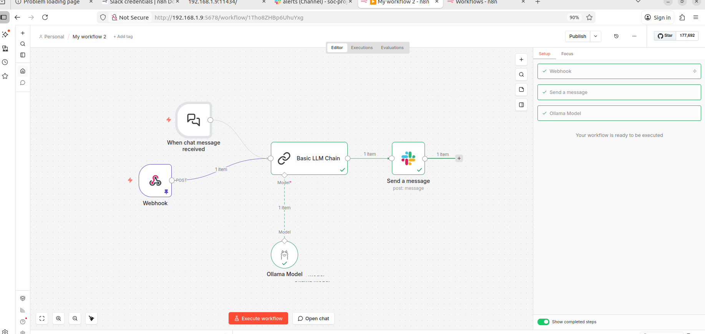
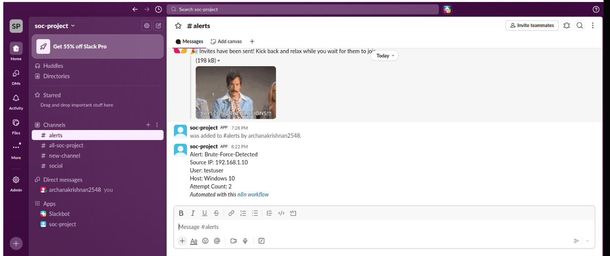

# AI-Assisted SOC Alert Automation using Splunk, n8n and Ollama
AI-assisted SOC alert automation lab using Splunk SIEM, n8n workflow automation, Ollama LLM, and Slack integration to detect and analyze brute-force attacks.

## Project Overview
This project demonstrates an automated SOC (Security Operations Center) workflow that detects a brute-force attack, analyzes the alert using a local AI model, and sends an automated notification to Slack.

The system integrates Splunk SIEM, n8n workflow automation, and Ollama LLM to simulate how modern SOC teams automate alert triage and response.

## Architecture

The project environment consists of four virtual machines deployed in a controlled SOC lab environment to simulate real-world security monitoring, attack detection, and automated alert response.


1. Kali Linux – Attacker machine used to simulate brute-force attacks
2. Ubuntu Desktop – Splunk SIEM server for log analysis and alert generation
3. Ubuntu Server – Automation server running n8n (Docker) and Ollama AI model
4. Windows 10 – Target machine with Splunk Universal Forwarder installed

Attack Flow:

Kali Attacker → Windows Target → Splunk SIEM → Webhook → n8n Automation → Ollama AI → Slack Alert

## Implementation Steps
## 1. Attack Simulation

A brute-force attack was launched from the attacker machine running Kali Linux against the Windows 10 target system to generate multiple authentication failures.
These failed login attempts created security events in the Windows Event Logs, simulating a real-world brute-force attack scenario.
```
hydra -l testuser -P password.txt rdp://192.168.1.10 
```
## 2. Log Collection
Windows security logs were forwarded to Splunk using Splunk Universal Forwarder.
Windows Event ID 4625 (failed login attempts) was used to detect suspicious authentication activity.
```
index=soc_project EventCode=4625 src_ip!=127.0.0.1
| stats count by _time, ComputerName, user, src_ip
```
This query filters failed authentication events and aggregates them by time, host, username, and source IP address to identify repeated login failures.
If multiple failed attempts occur within a short period, it indicates a possible brute-force attack.


## 3. Detection Rule

A Splunk search query was created to detect brute-force activity by identifying multiple failed login attempts within a short time window.

## 4. Webhook Integration

The Splunk alert action was configured to send alert data to an n8n Webhook URL.
This allows the SIEM alert to be automatically forwarded into the automation pipeline.


## 5. n8n Automation Workflow

An automated workflow was created using n8n to process the security alerts generated by Splunk Enterprise.

The workflow performs the following steps:
Receives the alert data from Splunk via Webhook

Extracts key fields from the alert payload:
Alert Name
Source IP Address
Username
Hostname
Attempt Count

Formats the alert data for AI analysis
Sends the structured alert data to the local AI model for further investigation



## 6. AI Analysis

The alert data is analyzed using a locally hosted LLM running on Ollama with the Phi-3 Mini model.
The AI processes the alert and generates a short security analysis including:

Alert Summary
Possible Attack Type
Risk Level
Recommended Investigation Steps

This step demonstrates how AI can assist SOC analysts by providing quick contextual insights about security alerts.



## 7. Slack Notification

After AI analysis, the final alert information is automatically sent to a SOC notification channel in Slack for real-time visibility.



## Tools & Technologies

Splunk Enterprise
Splunk Universal Forwarder
n8n
Ollama
Phi-3 Mini LLM
Slack
Docker
Kali Linux
Windows 10

## Key Features

✔ Simulated real SOC attack scenario
✔ SIEM detection using Splunk
✔ Automated alert forwarding via webhook
✔ AI-assisted security analysis
✔ Real-time Slack alerting
✔ Fully automated SOC workflow

## 📊 Skills Demonstrated

SIEM log analysis
Splunk alert engineering
Security automation
SOC workflow development
AI integration in cybersecurity
Incident detection & alerting
Threat monitoring

## Learning Outcome

This project demonstrates how SOC teams can combine SIEM platforms, workflow automation tools, and AI models to reduce alert fatigue and improve incident response efficiency.

